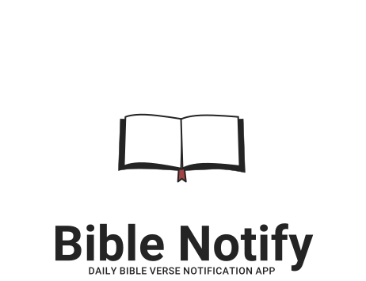

  
  <h1>Bible Notify Desktop</h1>
  

  
  
  
  

  
Daily Scripture Verse Notifications on Desktop.

<!--This is the repository for the Desktop version of the daily Bible verse notification app for Android called [Bible Notify](https://github.com/BibleNotify/BibleNotify).-->

# Running the code

## Linux

Python is pre-installed on Linux systems already

1. Execute the command ``python3 -m pip install -r requirements.txt`` in a terminal of your choice.
2. Change into the ``src`` directory by running ``cd src/``
3. Run Bible Notify with ``python3 main.py``

## Windows

1. Install Python if it isn't installed already. Go to [here](https://www.python.org/downloads/windows/), download the latest version and then run the installer.
2. Execute the command ``python -m pip install -r requirements.txt`` in a terminal of your choice.
3. Change into the ``src`` directory by running ``cd src/``
4. Run Bible Notify with ``python main.py``

## Element chat

Need help? Want to help out? [Join our Element chat](https://matrix.to/#/#bible-notify:matrix.org) to chat with the developers or get support.

## Contributing

Contributions are always welcome! Feel free to open a PR or ask questions.

## Generating assets.py

- ``cd src/assets``
- ``pyside6-rcc assets.qrc -o assets.py``

# License

Licensed under the GPL-3.0 license.
